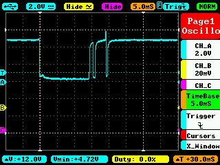
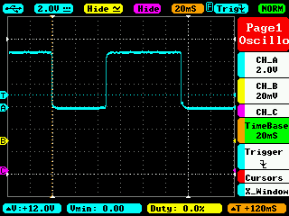
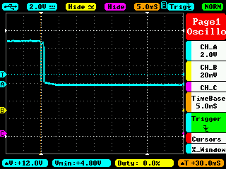
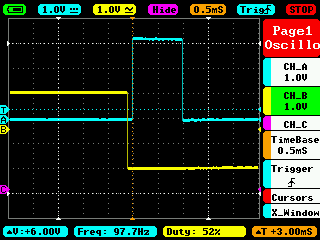
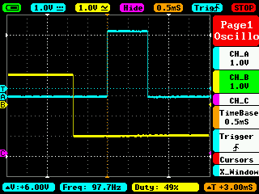
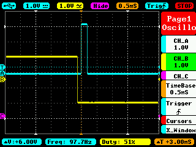

# USB Teensy Joystick

**Note: This is still work in progress. I.e. not finished.**

The idea to write the firmware for an USB controller raise din me when doing the USB controller measurements in 
[LagMeter](../LagMeter/Readme.md).
It is quite invisible what a usual game controllers does when sampling the buttons and the axis data and what delay it might add.
The only information one gets is the suggested polling rate that the game controller requests from the USB host.
But this is only part of the story: the firmware of the game controller need to sample the joystick data and prepare it in time, i.e. within this polling interval.
Furthermore I wanted to have control on the debouncing and minimum press time.
So the only way to get absolute control on what is happening on the firmware side is to write it by myself.

This project is about the firmware of a USB controller. It's not about the HW. So, if you would want to do this on your own you can use an Arcade stick or buttons or use the HW of a USB controller, throw it's electronics away and substitute it with a Teensy board and this SW.

The features are:
- Requested 1ms USB poll time
- Additional delay of max. (??)
- Indication of the real used USB poll time

Used HW is a cheap Teensy LC board that you can get around 10€.

# SW / Firmware

In general the main loop of a game controller is quite simple:
1. Read buttons and axis
2. Prepare data for USB
3. Wait until USB poll to transfer data
4. Goto 1

## Minimum Press Time

Measurements in the LagMeter project showed that it is possible to achieve key presses of 14ms with a leaf switch button:

With a micro switch  the smallest time is around 45ms:

Bouncing was in the range of 5ms.
Here the bouncing of a micro switch:

This results in the following requirements:
- We need a debouncing of 5ms
- Since I'm optimizing for a game's poll time of 20ms (europe, US would be 17ms) and the minimum achievable time is 14ms, the time need to be extended to at lease 20ms + USB poll time + firmware delay, so approx. 22ms.
Note: If you have lower game poll time's, e.g. if you have higher screen update rates, then you should adapt his value.
But anyhow: this is only important for leaf switches. Micro switches anyway have a higher close-time.

Debouncing and minimum press time uses the same algorithm. It extends the simple main loop to:
1. For each button and axis:
    - If timer value is 0: Check if button or axis changed
        - If changed: Restart timer, use the new value.
    - If timer value is not 0: Reduce timer value
2. Send USB data / wait for poll
3. Goto 1

## Additional Delay

If we would simply wait for an USB poll and then right after that read the joystick values this would introduce a delay of 1x the polling rate.
I.e. if you would press a button just after the sampling it would require once the poll time until it is sampled the next time + the usb poll time.
E.g. for a 1ms USB poll time this would result in 2ms.

The delay is illustrated here: the USB poll time is 1ms. The sampling takes place right after the last USB poll.
The input (yellow) is generated by a function generator which runs at 100Hz and is not synchronized with the USB polling rate. Because it is not synchronized it sometimes presses the button (yellow line goes to 0) just before the sampling or just after the sampling which results in different total delays.
(When the blue line goes high the sampling takes place. When it goes down the next USB poll arrives.)

Button press just before the sampling:

Button press just after the sampling:

The total delay is from button press (yellow line goes down) until USB poll (blue line goes down), i.e. 1ms to 2ms.

This can be seen very nice in this [video](Images/button_press_delay.mp4).

In order to reduce this we move the sampling by 0.8ms after the last USB poll.
This will end up in 1ms + 0.2ms = 1.2ms total max lag.

Button press just before the sampling:

Button press just after the sampling:

The total delay here is 0.2ms to 1.2ms.

There are problems with this approach:
- The value is helpful only for 1ms poll time. If e.g. 8ms are used it would have to be changed to 7.8ms (instead of 0.8ms). -> I don't care: the UsbJoystick is anyway optimized for 1ms poll time. If another poll time is used by the host this is indicated (see [Host's Poll Time](#host-s-poll-time)).
- If the algorithm to read the button and axis values would take longer than the remaining 0.2ms we would miss the USB poll interval and the resulting lag would be even longer. Therefore there is a check done in SW that the execution of reading buttons and axis values is short enough.
If not: the main LED will start to blink fast.

## Host's Poll Time

The firmware will show the current used USB polling rate in 2 ways.
1. On every USB poll it toggles the output of the USB_POLL_OUT output.
If you attach an oscilloscope you can see the the polling interval directly.
I.e. a 1ms polling looks like this:

2. The main LED (on the Teensy board) will be toggled depending on the USB poll interval. Every 1000th USB poll the LED will be toggled. I.e. for a 1ms interval the LED will toggle every 1 second. For 8ms USB interval the LED will toggle every 8 seconds.
