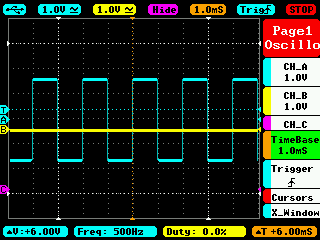

# Host's Poll Time

At startup the device will measure the polling time of the USB host.
The measured value is then output to the main LED:
- 1x blink = 1ms
- 2x blink = 2ms
- 4x blink = 4ms
- 8x blink = 8ms
- 5x fast blink 
The measurement is done only once.
The behavior very mich depends on the usb host.
On Mac you will see the blinking LED when you attach the device to the USB port.
On Linux it does not work: the right USB polling rate is used only if the device is really used.
As this is not the case directly after plugging it in the USB port the measurement fails.
On Windows (10) the USB poll measurement shows the right value on plug-in but the device itself is not recognized.

Another way to measure the poll rate is to use an oscilloscope at pin USB_POLL_OUT. It is toggle on each poll.
I.e. a 1ms polling looks like this:

