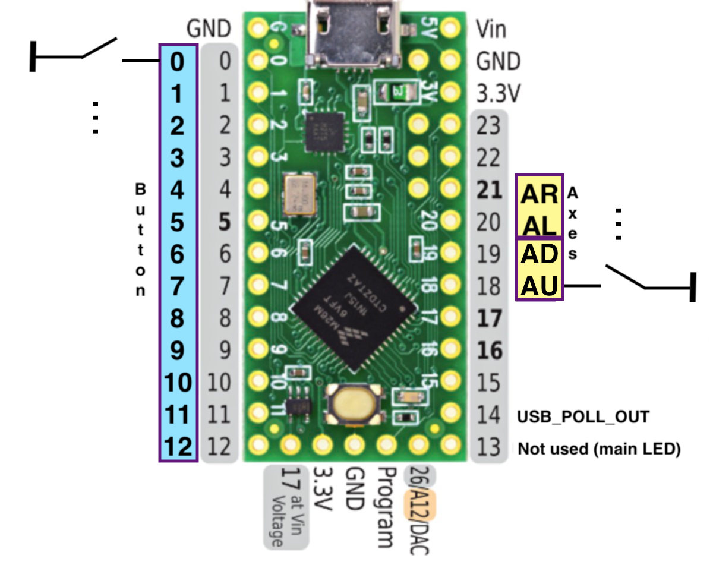

# Fastest Joystick

The idea to write the firmware for an USB controller raised in me when doing the USB controller measurements in 
[LagMeter](../LagMeter/Readme.md).
It is quite invisible what a usual game controller does when sampling the buttons and the axis data and what delay it might add.
The only information one gets is the suggested polling rate that the game controller requests from the USB host.
But this is only part of the story: the firmware of the game controller need to sample the joystick data and prepare it in time, i.e. within this polling interval.
Furthermore I wanted to have control on the debouncing and minimum press time for the buttons.
So the only way to get absolute control on what is happening on the firmware side is to write it by myself.

This project is about the firmware of a USB controller. It's not about the HW. So, if you would want to do this on your own you can use an Arcade stick or buttons or use the HW of an existing USB game controller, throw it's electronics away and substitute it with a Teensy board and this SW.

**The goal of this project is to create the fastest USB game controller firmware available with a guaranteed reaction time.** 

The features are:
- Requested 1ms USB poll time
- Additional delay of max. 200us.
- I.e. in total this is a reaction time in the range of 0.2ms to 1.2ms.
- Indication of the real used USB poll time

For comparison:
A typical game controller often has a poll time of 8ms. This in itself leads to a reaction time of 8 to 16ms. Sometimes the controller itself has another delay that needs to be added. So this not only jitters a lot, it is already quite close to 1 frame delay.
Even faster game controller with 1ms poll time introduce an inherent delay of about 5ms.
(I only heard of 1 USB controller with a 1ms delay but unfortunately I lost the link.)

# HW

Used HW is a cheap Teensy LC board that you can get around 10€.

The pinout is used as following (but can be changed to fit your needs):

Note: All pinouts I found for the axes JST connectors were different, so I have chosen the pinout above. If you need a different one you just have to change the wiring.

# SW / Firmware

In general the main loop of a game controller is quite simple:
1. Read buttons and axis
2. Prepare data for USB
3. Wait until USB poll to transfer data
4. Goto 1

## Minimum Press Time

Measurements in the LagMeter project showed that it is possible to achieve key presses of 14ms with a leaf switch button:

With a micro switch  the smallest time is around 45ms:

Bouncing was in the range of 5ms.
Here the bouncing of a micro switch:

This results in the following requirements:
- We need a debouncing of 5ms
- Since I'm optimizing for a game's poll time of 16.7ms (US, Europe would be 20ms) and the minimum achievable time is 14ms, the time need to be extended to at lease 16.7ms + USB poll time + firmware delay, so approx. 18ms.
To allow also for 50Hz systems (Europe, 20ms) I extend it to 25ms to allow for some variation.

Note: If you have lower game poll time's, e.g. if you have higher screen update rates, then you could adapt this value (MIN_PRESS_TIME).
But anyhow: this is only important for leaf switches. Micro switches anyway have a higher close-time.

Debouncing and minimum press time uses the same algorithm. It extends the simple main loop to:
1. For each button and axis:
    - If timer value is 0: Check if button or axis changed
        - If changed: Restart timer, use the new value.
    - If timer value is not 0: Reduce timer value
2. Send USB data / wait for poll
3. Goto 1

## Additional Delay

If we would simply wait for an USB poll and then right after that poll read the joystick values this would introduce a delay of 1x the polling rate. I.e. if you would press a button just after the sampling happened it would require once the poll time until it is sampled the next time + the usb poll time.
E.g. for a 1ms USB poll time this would result in 2ms.

The delay is illustrated here: the USB poll time is 1ms. The sampling takes place right after the last USB poll.
The input (yellow) is generated by a function generator which runs at 100Hz and is not synchronized with the USB polling rate. Because it is not synchronized it sometimes presses the button (yellow line goes to 0) just before the sampling or just after the sampling which results in different total delays.
(When the blue line goes high the sampling takes place. When it goes down the next USB poll arrives.)

Button press just before the sampling:

Button press just after the sampling:

The total delay is from button press (yellow line goes down) until USB poll (blue line goes down), i.e. 1ms to 2ms.

This can be seen very nice in this [video](Images/button_press_delay.mp4).

In order to reduce this we move the sampling by 0.8ms after the last USB poll.
This will end up in 1ms + 0.2ms = 1.2ms total max lag.

Button press just before the sampling:

Button press just after the sampling:

The total delay here is 0.2ms to 1.2ms.

This approach has one main problem:
If the algorithm to read the buttons and axes values would take longer than the remaining 0.2ms we would miss the USB poll interval and the resulting lag would be even longer. Therefore there is a check done in SW that the execution of reading buttons and axis values is short enough.
If this happens: the main LED and the button LEDs will start to blink fast.

In fact the tested time is even less than 0.2ms. I use 0.1ms. I.e. the algorithm starts 0.8ms after the last poll and has to finish 0.1ms before the next poll.
So we can cope also with a little jitter in the USB polling.

## Host's Poll Time

The firmware will show the current used USB polling rate in 2 ways.
1. On every USB poll it toggles the output of the USB_POLL_OUT output.
If you attach an oscilloscope you can see the the polling interval directly.
I.e. a 1ms polling looks like this:

2. The main LED (on the Teensy board) will be toggled depending on the USB poll interval. Every 1000th USB poll the LED will be toggled. I.e. for a 1ms interval the LED will toggle every 1 second. For 8ms USB interval the LED will toggle every 8 seconds.

Note: The LED and the USB poll digital out will be used only if the joystick endpoint is polled.
E.g. on Linux you may find that the main LED is not blinking if you connect the device to USB. You need to actually read from the joystick device (/dev/input/js?) e.g. by opening a joystick test program (e.g. jstest-gtk).

## USB packet queue

In the Teensy it doesn't seem to be easily possible to detect when the host does an USB poll.
One way is to send a packet and check when the packet has been read (usb_tx_packet_count).
Unfortunately this involves that a packet has to be sent even if no new data is available.

Furthermore the library uses a queue of 3 packets (TX_PACKET_LIMIT).
If we simply write into the queue we end up in a delay of 3ms.
So the SW makes sure that always only 1 packet is used. I.e. the packet is immediately sent in the next USB poll.

# Errors

You hopefully never see an error. The errors here are created by program ASSERTs. I.e. they are helpful during debugging but should not occur under normal conditions.

When an error occurs the main LED starts blinking fast. 

From that point on the joystick is not reporting any axes information or button presses anymore until you re-connect it to USB.

Thus, as long as the joystick is working you can be sure of it's guaranteed lag time.

# Misc

The branch 'joystick_and_output' contains SW that allows to use the Teensy as joystick and additionally configure ports for digital output.

I'm not supporting this anymore because I decided to split this in 2 separate git repositories, see the 'usbout' git repository.

